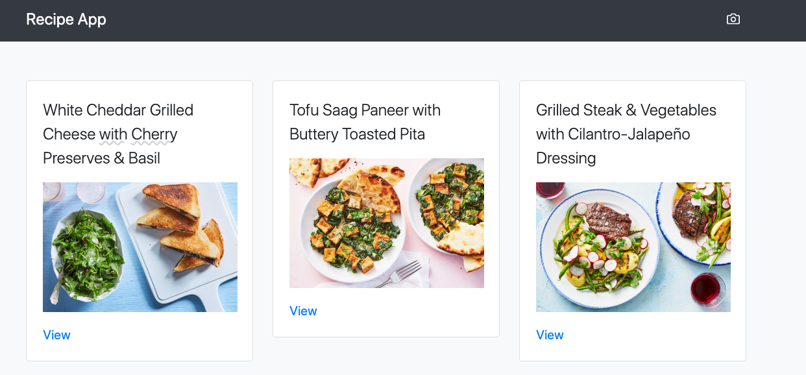

# Recipe Web App 

Recipe App is a catalog with a tasty and healthy recipe

<p></p>

> Created with Ruby SDK for the Contentful [Content Delivery API](https://www.contentful.com/developers/docs/references/content-delivery-api/) and [Content Preview API](https://www.contentful.com/developers/docs/references/content-preview-api/). applications.


## Development Requirements

  * Ruby 2.6.0+
  * Rails 6.0+
  * Bundler

## Installation

```
rvm install 2.7.0
rvm use 2.7.0
bundle install
```

## Configuration

 Before start, you should have an API key and Space ID to an API on Contentful. 
 Read more and create on [Content Delivery API](https://www.contentful.com/developers/docs/references/content-delivery-api/)
 
Create **.env** file in root derectory and add your credantails:

CONTENTFUL_ACCESS_TOKEN = 'access_token' 
CONTENTFUL_SPACE_ID = 'space_id' 
CONTENTFUL_ENVIRONMENT = 'master' 

## Pagination

If you want to add pagination for items, plese use [Pagy](https://github.com/ddnexus/pagy) gem

## How to run the test suite

Before running a test, please make sure you have a fresh version of the code:

```shell
git pull
bundle exec rspec spec/path/to/file_spec.rb
```

To run all the tests, please use:

```shell
bundle exec rspec spec
```

## License

This repository is published under the MIT license.

## Copyright

Copyright © 2020 Recipe Web App
